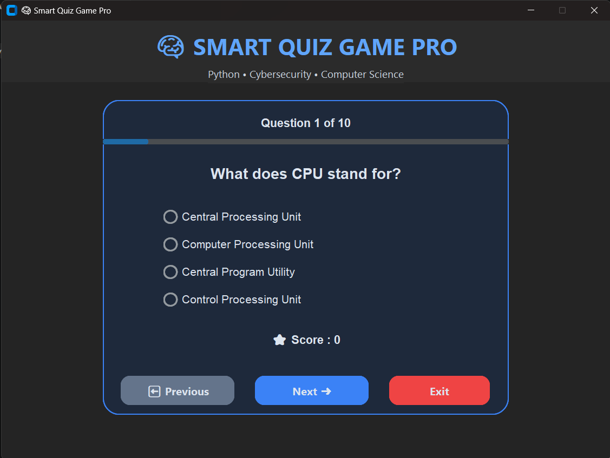
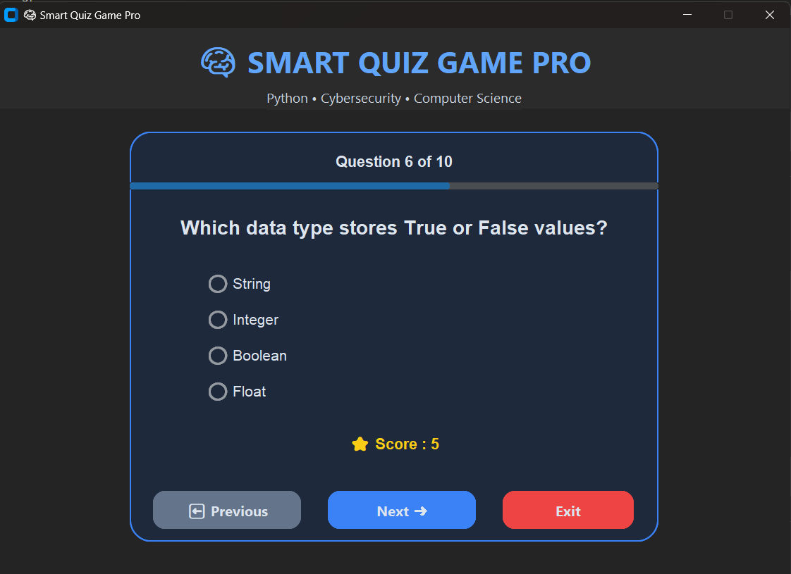
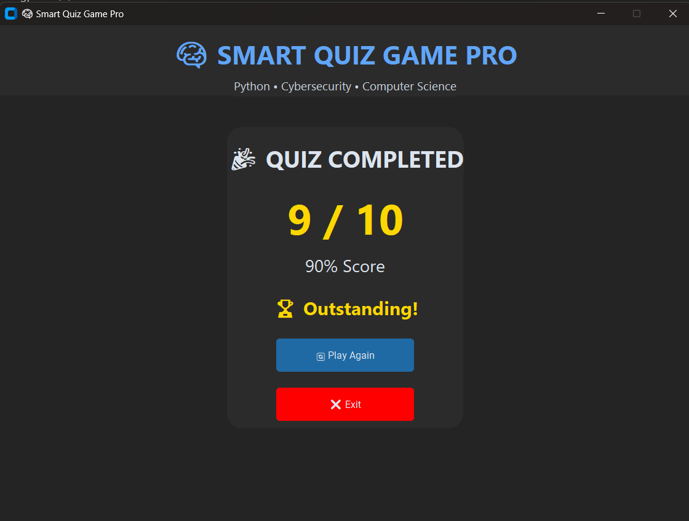
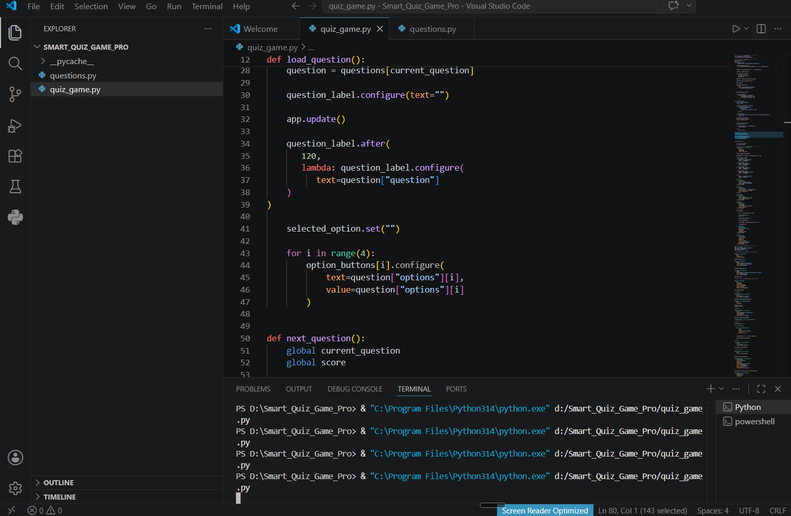

# 🧠 Smart Quiz Game Pro

A modern GUI-based Quiz Game developed in Python using CustomTkinter.

## 📌 Features

- Modern GUI
- Multiple Choice Questions
- Score Tracking
- Progress Bar
- Result Window
- Performance Badge
- Restart Quiz
- Exit Button

## 🛠 Technologies Used

- Python
- CustomTkinter
- Tkinter

## 📂 Project Structure

```
quiz_game.py
questions.py
README.md
requirements.txt
screenshots/
```

## 🚀 How to Run

1. Install Python

2. Install dependencies

```bash
pip install customtkinter
```

3. Run

```bash
python quiz_game.py
```

# 📷 Screenshots

## 🏠 Home Screen



---

## 📝 Quiz Screen



---

## 🏆 Result Screen



---

## 💻 Source Code



---

## 📖 Concepts Used

- Functions
- Lists
- Dictionaries
- Loops
- Conditional Statements
- GUI Programming
- Event Handling

## 👩‍💻 Developed By

**Kashaf Waheed**

Cyber Security Student

Mehran University of Engineering & Technology (MUET)

---

SoftGrowTech Python Programming Internship Project